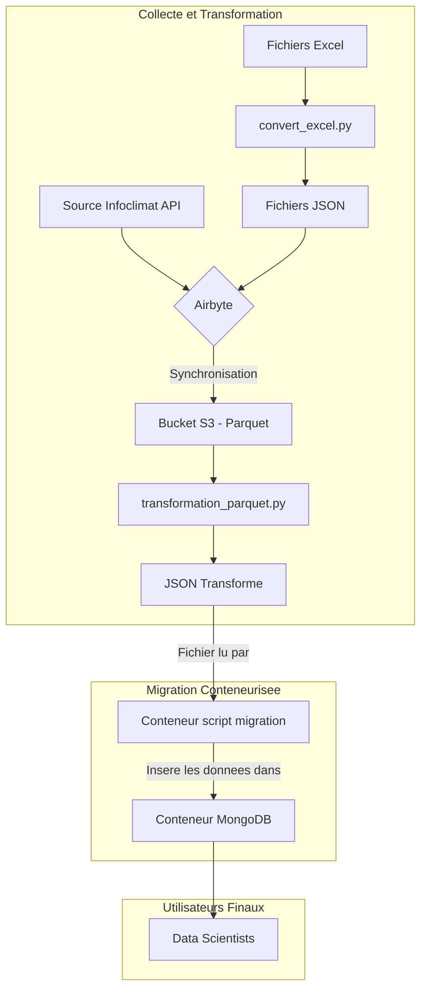

# Projet 8 - Pipeline de Données Météorologiques

Ce projet met en place un pipeline de données pour GreenAndCoop. Le processus complet implique une étape de pré-traitement locale, une synchronisation via Airbyte (implicite), puis un pipeline de transformation qui télécharge les données depuis S3 pour les préparer à être stockées dans MongoDB.

## Logique du Pipeline

Le processus se déroule en plusieurs scripts :

1.  **`convert_excel.py` (Pré-traitement)**
    Ce script convertit les données sources depuis des fichiers Excel en fichiers JSON. Il crée une colonne `timestamp` complète en combinant la date (du nom de la feuille) et l'heure.
    *Cette étape est manuelle et doit être exécutée si les fichiers Excel changent.*

2.  **`transformation_parquet.py` (Transformation)**
    Ce script récupère les données depuis S3 (après synchronisation Airbyte), les nettoie, les transforme, et les unifie en un seul fichier JSON (`data_for_mongodb.json`).
    *Cette étape est également considérée comme faisant partie de la préparation des données avant la migration.*

3.  **`migrate_to_mongodb.py` (Migration)**
    Ce script prend le fichier JSON final et l'importe dans la base de données MongoDB. Il est conçu pour être exécuté dans un conteneur Docker.

## Migration via Docker

Cette section explique comment exécuter la migration des données vers une base de données MongoDB en utilisant Docker Compose. Cela combine la migration et la conteneurisation.

### 1. Prérequis
- **Docker et Docker Compose** 
- **Données Transformées** : Le fichier `transformed_data/data_for_mongodb.json` 

### 2. Exécution de la Migration avec Docker

1.  **Lancez Docker Compose** :
    Ouvrez un terminal à la racine du projet et exécutez la commande suivante :
    ```bash
    docker-compose up --build
    ```
    Cette commande va :
    - **Construire l'image Docker** pour le script de migration en se basant sur le `Dockerfile`.
    - **Télécharger l'image officielle de MongoDB**.
    - **Démarrer deux conteneurs** : un pour la base de données (`mongodb`) et un pour le script (`migration-script`).
    - Le script de migration attendra que la base de données soit prête, puis se connectera et importera les données.

2.  **Vérification** :
    - Les logs du conteneur `migration-script` afficheront le statut de la migration, y compris le nombre de documents insérés.
    - Une fois la migration terminée, le conteneur du script s'arrêtera. Le conteneur MongoDB continuera de fonctionner.
    - Vous pouvez vous connecter à la base de données sur `mongodb://localhost:27017` avec un outil comme MongoDB Compass pour vérifier que la collection `weather_stations` a bien été créée et remplie.

3.  **Arrêter et nettoyer** :
    Pour arrêter le conteneur MongoDB et supprimer le volume de données, exécutez :
    ```bash
    docker-compose down -v
    ```

## Logigramme du Pipeline de Données

Voici une représentation du flux de données complet, de la source à la base de données finale.


